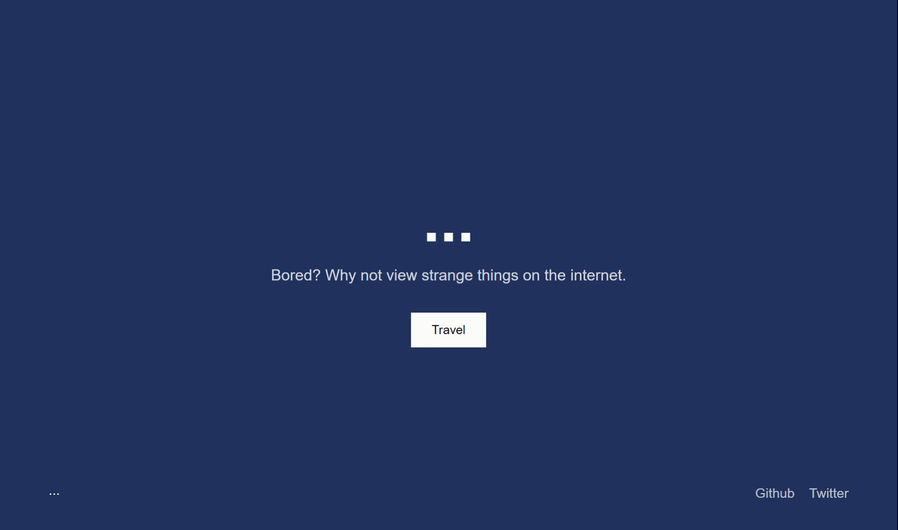

# travel-randomly

## Explore all things strange, from articles, websites and pictures found on the internet,     randomly. 🌎💚

### [visit website](https://travel-randomly.vercel.app/)
Made for those who want to contribute to a git repo. You can create issues (say hello, voice a feature or bugs...etc) or __add links__ to articles, websites or pictures of strange things you've found on the internet you'd like to share.

### Contributing to the repo

- Create a personal fork of the project on Github.
- Clone the fork on your local machine. Your remote repo on Github is called `origin`.
- Add the original repository as a remote called `upstream`.
- If you created your fork a while ago be sure to pull upstream changes into your local repository.
- Create a new branch to work on! Branch from `master`.
    - In the [modules folder](./modules), you'll find the data folder with a file named [contributorsInformation](./modules/data/contributorsInformation.mjs). Follow the comments written in where you add your name, github link and the link you would like to share.
- #### Optionally
    - Implement/fix your feature, comment your code.
    - Add or change the documentation as needed.

- Squash your commits into a single commit with git's [interactive rebase](https://help.github.com/articles/interactive-rebase). Create a new branch if necessary.
- Push your branch to your fork on Github, the remote `origin`.
- From your fork open a pull request in the correct branch. Target the project's `master`!
- ...
- Once the pull request is approved and merged you can pull the changes from `upstream` to your local repo and delete
your extra branch(es).

And last but not least: Always write your commit messages in the present tense. Your commit message should describe what the commit, when applied, does to the code – not what you did to the code. 🙂

_**If you find this guide difficult to understand, please raise an issue, work on it or let me know on twitter._

__note - all inappropriate additions will be rejected (e.g links to pornagraphic content...etc)__. 

An altered contribution guide by : [MarcDiethelm](https://gist.github.com/MarcDiethelm/7303312)

### git commands that are useful
git clone: This will clone the original code, example: git clone <your-copy-code>
git branch: This allows you to make changes without affecting other contributors code, example: git branch 'name-of-the-branch-you-want'
git checkout:This allows you to switch to the branch you just created, example: git checkout <name-of-your-branch>
git remote add upstream: Lets you add the original repo as upstream
git commit -m: This helps you commit the code, example: git commit -m "added git commands to the README.md file"
 git push origin -u: Allows you to push the original repo online i.e github, example: git push origin -u <name-of-your-branch>
 git add .: Allows you to save changes you made into your local git repository.